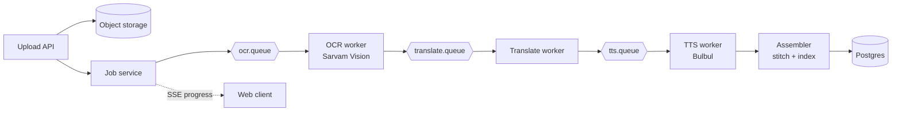
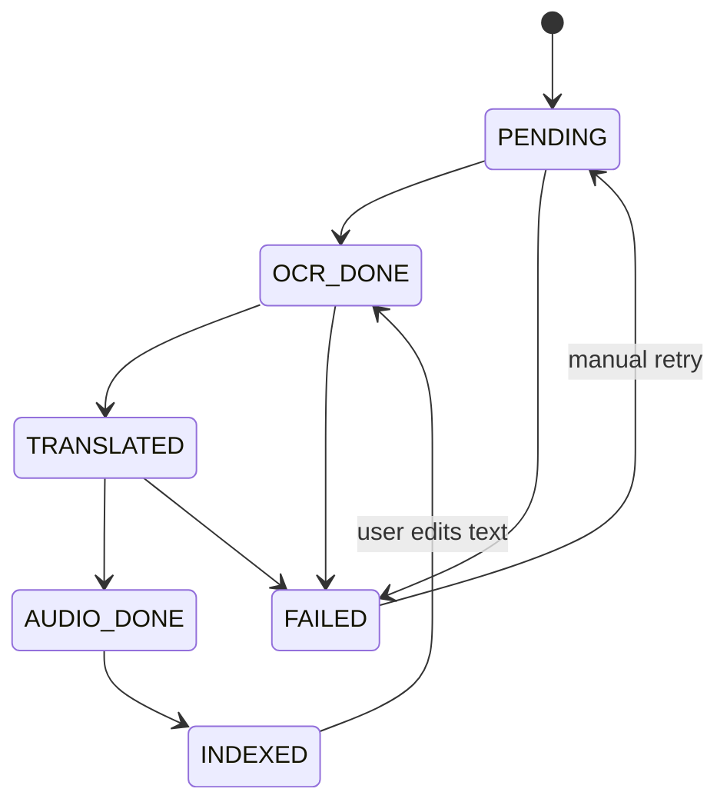

# Chitthi — Requirements Document

2026-09-21 · @Someone

## Overview

Chitthi turns scanned handwritten letters and documents in Indian scripts into a searchable archive and reads them aloud in natural Indian voices.

**Problem.** Many families hold old letters, diaries and ration cards in Devanagari, Gujarati, Bengali and other scripts. Elderly relatives often can't read small or faded handwriting, and younger ones often can't read the script at all. Nothing is searchable.

**Vision.** Upload a photo or PDF, get back the transcribed text, an English translation, and an audio readout. Everything is indexed so a family can search "Nanaji's letters from 1987" or "mentions of the Jaipur house".

**Why this project.** It uses three Sarvam capabilities end to end (Vision, Translate, Bulbul TTS). The hard parts are backend problems: an async job pipeline, page-level batching, retries against rate-limited APIs, cost tracking and search. That is the story to tell in a Backend Engineer application.

## Goals, non-goals and success metrics

The MVP succeeds if a 10-page handwritten Hindi letter goes from upload to searchable text and playable audio in under 3 minutes, with no manual steps.

**Goals**

- Reliable async pipeline: upload → OCR → translate → TTS → index, resumable at every stage
- Handle multi-page PDFs and image batches with page-level parallelism
- Full-text search across original script and English translation
- Per-document cost and latency tracking visible in a simple dashboard

**Non-goals (for the 2-week MVP)**

- Mobile app, sharing between family accounts, or payments
- Training or fine-tuning any model, or processing private family documents (the demo uses public-domain scans only)
- Perfect handwriting accuracy: the product exposes confidence and lets users correct text

**Success metrics**

| Metric | Target |
| --- | --- |
| End-to-end time, 10-page document | < 3 min (p95) |
| Pipeline success rate | ≥ 98% of pages without manual retry |
| Duplicate API calls on retry | 0 (idempotent stages) |
| Search latency | < 300 ms (p95) |
| Test coverage on pipeline services | ≥ 70% |

## Users and user stories

There is one primary user, the family archivist, and one secondary user, the listener.

- **Archivist** (25–40, tech-comfortable): scans and uploads documents, fixes transcription errors, tags people and dates.
- **Listener** (60+, may not read the script or small text): opens a shared link and taps play.

| # | As a… | I want to… | So that… |
| --- | --- | --- | --- |
| US1 | Archivist | upload a multi-page PDF or several photos at once | I don't process pages one by one |
| US2 | Archivist | see live progress per page | I know it's working and what failed |
| US3 | Archivist | edit the transcribed text | mistakes don't flow into audio and search |
| US4 | Archivist | tag a document with people, year and place | the archive is browsable |
| US5 | Archivist | search across originals and translations | I find a letter by what it says |
| US6 | Listener | play the letter aloud in its original language or in translation | I can hear it without reading |
| US7 | Archivist | regenerate audio after an edit, paying only for changed pages | edits stay cheap |

## Functional requirements

The P0 items are the MVP; P1 items are stretch goals if the first week goes well.

| ID | Requirement | Priority |
| --- | --- | --- |
| FR1 | Accept JPG, PNG and PDF uploads up to 20 MB and 30 pages per document; split PDFs into page images | P0 |
| FR2 | Create a processing job per document, with one task per page per stage | P0 |
| FR3 | Extract text with Sarvam Document AI in chunks of 10 pages or fewer; split results back into pages and store the raw output | P0 |
| FR4 | Take the document language at upload; translate each page to English with Sarvam Translate | P0 |
| FR5 | Generate audio per page with Bulbul in the original language (if supported) and in English; stitch pages into one track | P0 |
| FR6 | Stream job progress to the client (per page, per stage) over Server-Sent Events | P0 |
| FR7 | Retry failed tasks with exponential backoff; move to a dead-letter state after 3 attempts; allow manual retry | P0 |
| FR8 | Let users edit page text; an edit invalidates only that page's translation and audio | P0 |
| FR9 | Full-text search across original and translated text, filterable by tag and year | P0 |
| FR10 | Record API calls, units consumed (pages, characters) and estimated cost per document | P0 |
| FR11 | Share a read-and-listen link for a document, with expiry | P1 |
| FR12 | Pre-process images (deskew, contrast) before OCR to improve accuracy | P1 |
| FR13 | Cache TTS output by text hash so repeated regeneration costs nothing | P1 |
| FR14 | Require sign-in (Google OAuth via Spring Security) for uploads, edits and search; each user sees only their own documents | P0 |
| FR15 | Enforce a daily cap of 7,000 processed words per user, plus per-IP request rate limits on public endpoints | P0 |

## Non-functional requirements

Reliability and cost control matter more than raw speed, because every stage calls a paid, rate-limited external API.

- **Idempotency.** Each stage task has a deterministic key (document, page, stage, content hash). A retried or duplicated message never triggers a second paid API call.
- **Resumability.** A crash mid-job resumes from the last completed stage per page, not from the start.
- **Rate limiting.** A client-side token bucket per Sarvam endpoint keeps calls under quota. On HTTP 429, respect `Retry-After`.
- **Resilience.** A circuit breaker per endpoint opens after repeated failures; jobs pause rather than burning retries.
- **Latency.** Pages process in parallel with a configurable concurrency cap (default 5).
- **Observability.** Structured logs with a job ID on every line; metrics for stage latency, error rate and API spend.
- **Privacy.** Documents are personal. Files are stored privately with signed URLs, API keys stay server-side, and users can hard-delete a document and all derived data.
- **Cost ceiling.** Each user can process up to 7,000 words a day. Words are counted after OCR; pages past the cap stop before translation and TTS, and new uploads are rejected until the next day.

## Architecture and pipeline design

The design is a modular Spring Boot monolith with a message queue between stages. OCR runs per chunk of up to 10 pages, as Sarvam's Document AI requires. After OCR, each page moves through translation and TTS independently, so one bad page never blocks the rest.

Each worker reads a message, checks the idempotency key in Postgres, calls Sarvam, persists the output, and publishes to the next queue in the same transaction using a transactional outbox. Failures go to a retry queue with a delay; after 3 attempts they go to a dead-letter queue.

**Page state machine**

A document is COMPLETE when every page is INDEXED, and PARTIAL when some pages are dead-lettered. An edit sends the page back to OCR\_DONE with the corrected text, so only translation and audio re-run.

## Sarvam API integration

Three Sarvam APIs do the work. Their limits shape the pipeline more than anything else: OCR is an async job capped at 10 pages, and Vision allows only 10 requests per minute on every plan.

| Stage | API and model | Hard limits | Design consequence |
| --- | --- | --- | --- |
| OCR | [Document AI Digitise](https://docs.sarvam.ai/api/api-guides-tutorials/document-intelligence/overview), Sarvam Vision 1.5, `POST /doc-ai/v1/job/digitise` | Max 10 pages per PDF or ZIP; 10 requests/min, same on all plans; language must be passed | Split documents into chunks of 10 pages or fewer; one Sarvam job per chunk; global rate limiter on job creation |
| OCR status | `GET /doc-ai/v1/job/{id}/status`, then `/download-url` | Async; states pending, running, completed, partially\_completed, failed, rejected | A poller with backoff (5 s start); map `partially_completed` to per-page FAILED |
| Translate | [Translate API](https://docs.sarvam.ai/api/models/sarvam-translate), `sarvam-translate:v1` | 2,000 characters per request; formal style only; 22 languages | Chunk text at sentence boundaries of 2,000 characters or fewer |
| TTS | [Bulbul v3](https://docs.sarvam.ai/api/text-to-speech/convert) | 2,500 characters per request; 11 languages (10 Indian + English); base64 audio in response | Chunk text, then concatenate audio; if the language isn't among the 11, generate English audio only |

**Language handling.** Document AI needs the language up front, so the upload form asks for it (default Hindi). Translate and TTS reuse that code.

**Output parsing.** Digitise returns a ZIP with the main file, one `metadata/page_NNN.json` per page, and a `manifest.json`. Chitthi uses `output_format=md` and reads the per-page JSON to split text back into pages.

**Rate limits** are per account, per API, and replenish continuously like a token bucket ([rate limits](https://docs.sarvam.ai/api-reference-docs/ratelimits)). Chitthi mirrors that with one Resilience4j `RateLimiter` per endpoint, so all workers share one budget.

**Client.** Sarvam's official SDKs are Python and JavaScript. Chitthi calls the REST API directly from Java through a typed Spring `RestClient` wrapper (`SarvamClient`), with the `api-subscription-key` header injected from configuration. That wrapper is itself a useful talking point in an interview.

**Approximate cost per 10-page letter** (about 1,500 characters per page): Vision at ₹0.5 per page ([Sarvam, May 2026](https://www.linkedin.com/company/sarvam-ai)) comes to ₹5; Bulbul at roughly ₹30 per 10,000 characters ([third-party estimate, Aug 2026](https://invideo.io/blog/sarvam-bulbul-indian-tts/)) comes to about ₹90 for two audio tracks. Translation at the 7,000-word daily cap comes to about ₹21 per user per day. Treat TTS as the main cost driver.

## Data model and API endpoints

Six tables in Postgres cover the MVP. Files and audio live in object storage; the database stores only keys.

| Table | Key columns | Purpose |
| --- | --- | --- |
| `document` | id, owner\_id, title, language, status, tags (jsonb), year, created\_at | One uploaded letter or bundle |
| `page` | id, document\_id, page\_no, image\_key, status, original\_text, translated\_text, text\_hash, edited (bool) | One page and its current outputs |
| `ocr_batch` | id, document\_id, page\_range, sarvam\_job\_id, status, poll\_count, next\_poll\_at | One Sarvam Document AI job (up to 10 pages) |
| `stage_task` | id, page\_id, stage, idempotency\_key (unique), attempts, last\_error, status | One unit of work; the unique key blocks duplicate API calls |
| `api_call` | id, document\_id, endpoint, units, unit\_type, latency\_ms, http\_status, est\_cost\_inr | Cost and latency ledger |
| `outbox` | id, topic, payload, published\_at | Transactional outbox for queue messages |

**Search:** a generated `tsvector` column over `translated_text` plus a `pg_trgm` trigram index on `original_text`. Postgres has no stemming for Indic scripts, so trigrams keep substring search working in Devanagari.

**REST endpoints**

| Method | Path | Purpose |
| --- | --- | --- |
| POST | `/api/documents` | Multipart upload with title, language and tags; returns 202 with the document id |
| GET | `/api/documents/{id}` | Document with page statuses and output links |
| GET | `/api/documents/{id}/events` | SSE stream of page and stage progress |
| PUT | `/api/documents/{id}/pages/{n}/text` | Edit page text; re-queues translation and TTS for that page |
| POST | `/api/documents/{id}/retry` | Re-queue dead-lettered pages |
| GET | `/api/documents/{id}/audio?lang=orig\|en` | Signed URL for the stitched audio |
| GET | `/api/search?q=&tag=&year=` | Full-text search |
| GET | `/api/usage` | Spend and latency summary per document and day |
| DELETE | `/api/documents/{id}` | Hard delete of the document and all derived files |

## Tech stack

The stack stays on familiar Java ground, plus RabbitMQ, which adds a real message broker to the résumé.

| Layer | Choice | Why |
| --- | --- | --- |
| Language and framework | Java 21, Spring Boot 3.x | Virtual threads suit I/O-heavy polling and API calls |
| Queue | RabbitMQ (Spring AMQP) | Delayed retry and dead-letter queues come built in |
| Database | PostgreSQL 16 + Flyway | Transactions for the outbox, `pg_trgm` for Indic search |
| Object storage | MinIO locally, S3-compatible in the cloud | Signed URLs for private files |
| Resilience | Resilience4j (RateLimiter, CircuitBreaker, Retry) | Maps directly to Sarvam's limits |
| PDF and image handling | Apache PDFBox for page splitting; Java ImageIO | Pure Java, no native dependencies |
| Audio stitching | FFmpeg called through ProcessBuilder | Concatenates WAV chunks reliably |
| Observability | Micrometer + Prometheus + Grafana; JSON logs | Stage latency and spend dashboards |
| Testing | JUnit 5, Testcontainers (Postgres, RabbitMQ, MinIO), WireMock for Sarvam | Pipeline tests without spending API credits |
| Frontend | Minimal React or Next.js page: upload, progress, reader with audio player | Kept thin on purpose; the backend is the showcase |
| Delivery | Docker Compose; GitHub Actions for build and test | One command to run locally |

## Two-week delivery plan

Week 1 builds the pipeline end to end on one happy path. Week 2 makes it robust, measurable and presentable. It assumes about 3 hours on weekdays and 8 on weekends.

| Days | Deliverable | Done when |
| --- | --- | --- |
| 1–2 | Project skeleton, Docker Compose (Postgres, RabbitMQ, MinIO), Flyway schema, `SarvamClient` with a WireMock contract test | `docker compose up` runs, and one real Digitise call works from a test |
| 3–4 | Upload API, PDF splitting, OCR batching (10 pages or fewer), status poller | A 12-page PDF yields 12 pages of text in the database |
| 5–6 | Translate and TTS workers, sentence chunking, audio stitching | One document plays in both languages |
| 7 | SSE progress, simple React page | You can watch pages move through stages live |
| 8–9 | Idempotency keys, outbox, retry and dead-letter queues, Resilience4j limiters | A chaos test (kill the worker mid-job, inject 429s) finishes with 0 duplicate paid calls |
| 10 | Edit flow with partial regeneration, TTS cache by text hash | Editing page 3 re-runs only page 3 |
| 11 | Search, usage ledger, Grafana dashboard, sign-in and the daily word cap | Search under 300 ms; cost per document visible |
| 12 | Load test with 20 documents in parallel; tune concurrency against the 10 requests/min Vision limit | p95 end-to-end time recorded in the README |
| 13–14 | README with architecture diagram, a 3-minute demo video, and a short write-up of findings on Sarvam Vision accuracy for handwriting | App is deployed publicly; repo is public and linked in the application |

## Risks and open questions

The biggest risk is handwriting accuracy on old, faded letters, and that is outside your control. The design answers it with editing and partial regeneration rather than trying to fix OCR.

| Risk | Impact | Mitigation |
| --- | --- | --- |
| Poor OCR on faded or cursive handwriting | Wrong text flows into audio and search | Editing is P0; optional pre-processing (FR12); publish accuracy findings as a feature of the write-up |
| Vision limit of 10 requests/min | Queue backs up under load | Global rate limiter, FIFO fairness across users, visible queue position in the UI |
| Bulbul covers 11 languages, not 22 | No original-language audio for, say, Urdu or Nepali letters | Fall back to English audio; show a clear notice |
| API cost overruns during testing | Free credits run out | WireMock for all automated tests; real calls only in a tagged smoke suite; 7,000-word daily cap per user |
| Scope creep in 2 weeks | Unfinished demo | P1 items only after day 10 checkpoint |
| Sarvam API changes (Document AI replaced Document Digitization in 2026) | Client breaks | Isolate all calls in `SarvamClient`; contract tests pin the expected shape |

**Open questions**

- [x] Decided: the 3-minute target is realistic. Still time one real 10-page Digitise job on day 2 as a baseline.
- [x] Decided: translation spend at the 7,000-word daily cap is about ₹21 per user per day.
- [x] Decided: sample and test documents are public domain only. Family letters would need consent, and public-domain scanned manuscripts are a safer demo set.
- [x] Decided: deploy publicly. That adds sign-in and abuse limits (FR14, FR15) to the MVP.

**Sources**

- [Sarvam Document AI overview](https://docs.sarvam.ai/api/api-guides-tutorials/document-intelligence/overview)
- [Sarvam Translate model](https://docs.sarvam.ai/api/models/sarvam-translate)
- [Bulbul text-to-speech REST reference](https://docs.sarvam.ai/api/text-to-speech/convert)
- [Sarvam rate limits](https://docs.sarvam.ai/api-reference-docs/ratelimits)
- [Sarvam on LinkedIn (Vision pricing)](https://www.linkedin.com/company/sarvam-ai)
- [invideo on Bulbul v3 pricing](https://invideo.io/blog/sarvam-bulbul-indian-tts/)
