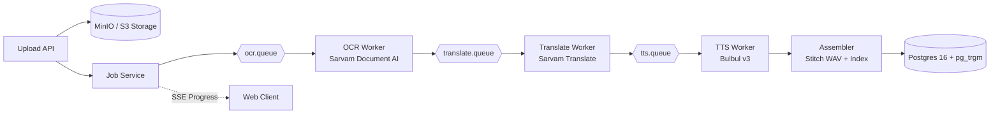
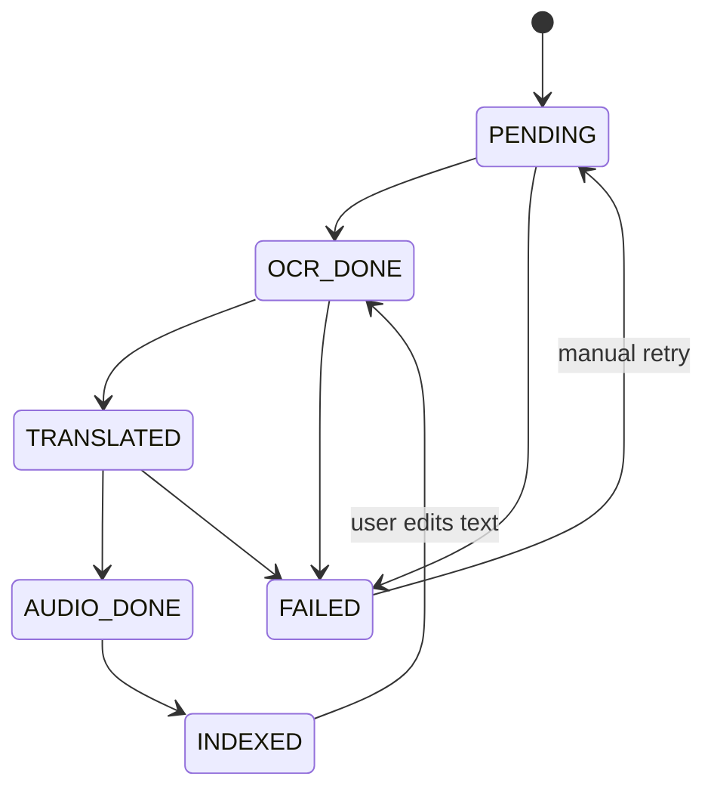

# Chitthi (चिठ्ठी) ✉️

> **Preserving Indian heritage letters through AI OCR, translation, and natural voice readouts.**

[](https://openjdk.org/projects/jdk/21/)
[](https://spring.io/projects/spring-boot)
[](https://www.rabbitmq.com/)
[](https://www.postgresql.org/)
[](https://opensource.org/licenses/Apache-2.0)
[]()

---

### 📌 GitHub Repository Details

* **Description:**  
  `Digitize, search, and listen to handwritten Indian letters & heritage documents using Sarvam AI (Vision 1.5, Translate, Bulbul TTS), Spring Boot 3, RabbitMQ, and PostgreSQL.`
* **Topics / Tags:**  
  `spring-boot` · `java-21` · `sarvam-ai` · `document-ai` · `ocr` · `indic-nlp` · `tts` · `bulbul-v3` · `rabbitmq` · `postgresql` · `pg-trgm` · `minio` · `resilience4j` · `wiremock` · `testcontainers` · `handwriting-recognition` · `digital-archiving`

---

## 📖 Overview

Many families hold boxes of old letters, personal diaries, and ancestral records written in Devanagari, Gujarati, Bengali, and other Indic scripts. Younger generations often cannot read the script, while elderly relatives struggle with faded, cursive handwriting. Crucially, none of these family records are searchable.

**Chitthi** transforms scanned handwritten documents into searchable, interactive archives and reads them aloud in natural Indian voices.

### 🌟 Core Capabilities

* **Multi-Page Async Ingestion:** Upload multi-page PDFs or image bundles (up to 20 MB, 30 pages) with automatic page-level batching.
* **Handwriting OCR (Sarvam Vision 1.5):** Digitizes handwritten Indic scripts via Sarvam Document AI in batches of up to 10 pages.
* **Indic Translation (Sarvam Translate):** Automatically translates extracted text into English with sentence-boundary chunking (<2,000 chars).
* **Audio Synthesis (Bulbul v3 TTS):** Synthesizes natural speech in the original Indic language (if supported) and in English using speaker `shubh`.
* **Sub-300ms Search:** Full-text search across translated English (`tsvector`) and fuzzy substring search across original Indic scripts via PostgreSQL trigrams (`pg_trgm`).
* **Zero Duplicate Paid Calls:** Deterministic idempotency keys `hash(doc_id, page_no, stage, content_hash)` prevent duplicate billable API invocations upon retries.
* **Selective Invalidation on Edit:** Editing page transcription re-runs translation and audio synthesis *only* for that page, keeping regeneration cost-effective.
* **Ledger & Cost Tracking:** Every third-party API call records consumed units (characters/pages), latency, and estimated cost in INR.

---

## 🏗️ Architecture & Pipeline

Chitthi is built as a resilient, asynchronous event-driven system leveraging RabbitMQ and the Transactional Outbox pattern:



### Page State Lifecycle



---

## 🛠️ Tech Stack

| Layer | Component | Description |
| :--- | :--- | :--- |
| **Runtime & Core** | Java 21, Spring Boot 3.4.3 | Virtual Threads enabled for high-throughput async I/O |
| **Message Broker** | RabbitMQ 3.13 | Spring AMQP with Dead-Letter Queues (DLQ) & retry routing |
| **Database** | PostgreSQL 16 + Flyway | Transactional outbox, `pg_trgm` GIN indexes, `tsvector` FTS |
| **Object Storage** | MinIO (AWS S3 SDK v2) | Private bucket storage with pre-signed download URLs |
| **AI Integration** | Sarvam AI REST Client | Typed Spring `RestClient` with connect & read socket timeouts |
| **Resilience** | Resilience4j | Token Bucket rate limiters (10 req/min for Vision) & Circuit Breakers |
| **Document Processing**| Apache PDFBox 3.0 | PDF splitting and image extraction |
| **Testing** | WireMock & Testcontainers | Zero-credit contract tests & isolated PostgreSQL testcontainers |

---

## 🚀 Quickstart

### Prerequisites
* **Java 21+**
* **Docker & Docker Compose**
* **Maven 3.9+**

### 1. Clone & Configure
```bash
git clone https://github.com/prashant-singh-2001/chitthi-path-2.git
cd chitthi-path-2
```

Configure your Sarvam API subscription key:
```bash
# On Linux/macOS:
export SARVAM_API_KEY="your-sarvam-api-key"

# On Windows (PowerShell):
$env:SARVAM_API_KEY="your-sarvam-api-key"
```

### 2. Start Backing Services
Launch PostgreSQL, RabbitMQ, and MinIO with a single command:
```bash
docker compose up -d
```

| Service | Host Port | Management Console / Endpoint | Credentials |
| :--- | :--- | :--- | :--- |
| **PostgreSQL 16** | `5433` | `jdbc:postgresql://localhost:5433/chitthi` | `chitthi` / `chitthi` |
| **RabbitMQ 3.13** | `5673` (AMQP), `15673` (UI) | `http://localhost:15673` | `chitthi` / `chitthi` |
| **MinIO Storage** | `9100` (API), `9101` (UI) | `http://localhost:9101` | `minioadmin` / `minioadmin` |

### 3. Run Automated Tests
Execute the full test suite (including WireMock contract tests and Testcontainers integration tests):
```bash
mvn clean test
```

### 4. Run the Application
```bash
mvn spring-boot:run
```
The API server will start on `http://localhost:8080`.

---

## 📡 REST API Reference

| Method | Endpoint | Description |
| :--- | :--- | :--- |
| `GET` | `/api/health` | Healthcheck and service version status |
| `POST` | `/api/documents` | Multipart document upload (`file`, `language`, `tags`, `year`) |
| `GET` | `/api/documents/{id}` | Get document status, per-page progress, and signed audio links |
| `GET` | `/api/documents/{id}/events` | Server-Sent Events (SSE) stream of real-time page pipeline progress |
| `PUT` | `/api/documents/{id}/pages/{n}/text` | Edit transcribed page text; selectively invalidates translation & TTS |
| `POST` | `/api/documents/{id}/retry` | Re-queue dead-lettered/failed stages for a document |
| `GET` | `/api/documents/{id}/audio?lang=orig\|en` | Presigned URL to download or stream stitched audio |
| `GET` | `/api/search?q=&tag=&year=` | Sub-300ms full-text and Indic trigram search across documents |
| `GET` | `/api/usage` | Consumption and estimated INR spend ledger per user and document |
| `DELETE`| `/api/documents/{id}` | Hard delete document, pages, database records, and S3 objects |

---

## 💰 Cost & Rate Limit Guardrails

Chitthi includes built-in safeguards to protect against quota exhaustion and unexpected bills:

* **Token Bucket Rate Limiting:** Enforces Sarvam's strict 10 requests/minute Document AI limit across all worker threads.
* **Daily Word Cap:** Enforces a configurable processing cap (default 7,000 words/user/day) preventing runaway usage.
* **Circuit Breakers:** Resilience4j circuit breakers pause processing when external APIs return sustained errors (503/429) rather than burning retries.
* **Cost Ledger:** Logs unit consumption (pages, characters) and estimated INR cost for each API call into the `api_call` table.

---

## 🧪 Testing Strategy

* **Zero-Credit Contract Testing:** [`SarvamClientWireMockTest`](src/test/java/com/chitthi/client/sarvam/SarvamClientWireMockTest.java) uses dynamic port WireMock to validate payload structures, headers (`api-subscription-key`), and response handling without calling real APIs.
* **Containerized DB Testing:** [`ChitthiApplicationTests`](src/test/java/com/chitthi/ChitthiApplicationTests.java) uses Spring Boot 3 `@ServiceConnection` and Testcontainers PostgreSQL to verify Flyway migrations and `pg_trgm` extension initialization.

---

## 📄 Contributing & Guidelines

Contributions are welcome! Please review:
* [CONTRIBUTING.md](CONTRIBUTING.md) — Setup and branch guidelines.
* [CODE_OF_CONDUCT.md](CODE_OF_CONDUCT.md) — Community standards.

---

## 📜 License

Licensed under the [Apache License, Version 2.0](LICENSE).
